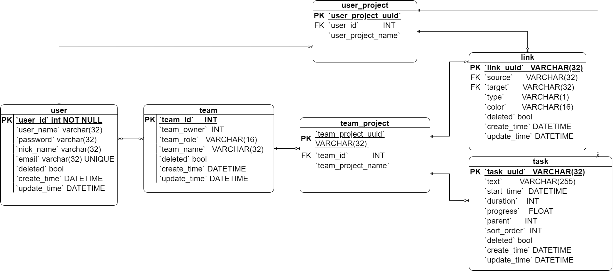

# 图表介绍

为了更好地介绍整个项目，笔者对整个项目进行了一些可视化地表述，此文档主要是对这些可视化表述的图表进行一些阐述和补充。


## 数据库设计

数据库的库表E-R模型存放在diagram文件夹下的gantt-db.drawio文件中，E-R模型PNG版如下图-1所示（省略了部分关联表）：



<p style="text-align:center">图-1</p>


其中使用的所有数据库定义语言如下：

```sql
CREATE DATABASE IF NOT EXISTS `gantt_db`
    DEFAULT CHARACTER SET = utf8mb4
    DEFAULT COLLATE = utf8mb4_unicode_ci;

USE `gantt_db`;

-- 用户表
CREATE TABLE IF NOT EXISTS `user`
(
    `user_id`     INT         NOT NULL AUTO_INCREMENT PRIMARY KEY,
    `user_name`    VARCHAR(32) NOT NULL,
    `password`    VARCHAR(32) NOT NULL,
    `nick_name`    VARCHAR(32) DEFAULT NULL,
    `email`       varchar(32) UNIQUE,
    `deleted`     BOOL NOT NULL DEFAULT false,
    `create_time` DATETIME    DEFAULT CURRENT_TIMESTAMP,
    `update_time` DATETIME    DEFAULT CURRENT_TIMESTAMP ON UPDATE CURRENT_TIMESTAMP
);

-- 任务数据表
CREATE TABLE IF NOT EXISTS `task`
(
    `task_uuid`   VARCHAR(32)  NOT NULL PRIMARY KEY,
    `text`        VARCHAR(255) NOT NULL COMMENT "项目名",
    `start_time`  DATETIME     NOT NULL,
    `duration`    INT          NOT NULL,
    `progress`    FLOAT        NOT NULL DEFAULT 0,
    `parent`      INT          NOT NULL,
    `sort_order`  INT          NOT NULL,
    `deleted`     BOOL NOT NULL DEFAULT false,
    `create_time` DATETIME              DEFAULT CURRENT_TIMESTAMP,
    `update_time` DATETIME              DEFAULT CURRENT_TIMESTAMP ON UPDATE CURRENT_TIMESTAMP
);

-- 连接信息表
CREATE TABLE IF NOT EXISTS `link`
(
    `link_uuid`   VARCHAR(32) NOT NULL PRIMARY KEY,
    `source`      VARCHAR(32) NOT NULL,
    `target`      VARCHAR(32) NOT NULL,
    `type`        VARCHAR(1)  NOT NULL COMMENT "连接线的类型",
    `color`       VARCHAR(16) COMMENT "连接线的颜色",
    `deleted`     BOOL NOT NULL DEFAULT false,
    `create_time` DATETIME DEFAULT CURRENT_TIMESTAMP,
    `update_time` DATETIME DEFAULT CURRENT_TIMESTAMP ON UPDATE CURRENT_TIMESTAMP,
    FOREIGN KEY (`source`) REFERENCES task (`task_uuid`),
    FOREIGN KEY (`target`) REFERENCES task (`task_uuid`)
);

-- 团队表
CREATE TABLE IF NOT EXISTS `team`
(
    `team_id`     INT         NOT NULL AUTO_INCREMENT PRIMARY KEY,
    `team_name`   VARCHAR(32) NOT NULL,
    `team_owner`  INT         NOT NULL,
    `deleted`     BOOL NOT NULL DEFAULT false,
    `create_time` DATETIME DEFAULT CURRENT_TIMESTAMP,
    `update_time` DATETIME DEFAULT CURRENT_TIMESTAMP ON UPDATE CURRENT_TIMESTAMP
);

-- user 和 team 关联表
CREATE TABLE IF NOT EXISTS `user_team`
(
    `user_id`   INT         NOT NULL,
    `team_id`   INT         NOT NULL,
    `team_role` VARCHAR(16) NOT NULL DEFAULT 'member',
    PRIMARY KEY (user_id, team_id),
    FOREIGN KEY (user_id) REFERENCES user (`user_id`) ON DELETE CASCADE,
    FOREIGN KEY (team_id) REFERENCES team (`team_id`) ON DELETE CASCADE
);

-- 个人项目表
CREATE TABLE IF NOT EXISTS `user_project`
(
    `user_id`           INT         NOT NULL,
    `user_project_name` VARCHAR(32) NOT NULL,
    `user_project_uuid` VARCHAR(32) PRIMARY KEY,
    `create_time`       DATETIME DEFAULT CURRENT_TIMESTAMP,
    `update_time`       DATETIME DEFAULT CURRENT_TIMESTAMP ON UPDATE CURRENT_TIMESTAMP,
    FOREIGN KEY (`user_id`) REFERENCES user (`user_id`) ON DELETE CASCADE
);

-- 个人项目 关联 task 的表
CREATE TABLE IF NOT EXISTS `user_project_tasks`
(
    `user_project_uuid` VARCHAR(32) NOT NULL,
    `task_uuid`         VARCHAR(32) NOT NULL,
    PRIMARY KEY (user_project_uuid, task_uuid),
    FOREIGN KEY (`user_project_uuid`) REFERENCES user_project (`user_project_uuid`) ON DELETE CASCADE,
    FOREIGN KEY (`task_uuid`) REFERENCES task (`task_uuid`) ON DELETE CASCADE
);

-- 个人项目 关联 link 的表
CREATE TABLE IF NOT EXISTS `user_project_links`
(
    `user_project_uuid` VARCHAR(32) NOT NULL,
    `link_uuid`         VARCHAR(32) NOT NULL,
    PRIMARY KEY (user_project_uuid, link_uuid),
    FOREIGN KEY (`user_project_uuid`) REFERENCES user_project (`user_project_uuid`) ON DELETE CASCADE,
    FOREIGN KEY (`link_uuid`) REFERENCES link (`link_uuid`) ON DELETE CASCADE
);

-- 团队项目表
CREATE TABLE IF NOT EXISTS `team_project`
(
    `team_id`           INT         NOT NULL,
    `team_project_name` VARCHAR(32) NOT NULL,
    `team_project_uuid` VARCHAR(32) PRIMARY KEY,
    `create_time`       DATETIME DEFAULT CURRENT_TIMESTAMP,
    `update_time`       DATETIME DEFAULT CURRENT_TIMESTAMP ON UPDATE CURRENT_TIMESTAMP,
    FOREIGN KEY (`team_id`) REFERENCES team (`team_id`) ON DELETE CASCADE
);

-- 团队项目 关联 task 的表
CREATE TABLE IF NOT EXISTS `team_project_tasks`
(
    `team_project_uuid` VARCHAR(32) NOT NULL,
    `task_uuid`         VARCHAR(32) NOT NULL,
    PRIMARY KEY (team_project_uuid, task_uuid),
    FOREIGN KEY (`team_project_uuid`) REFERENCES team_project (`team_project_uuid`) ON DELETE CASCADE,
    FOREIGN KEY (`task_uuid`) REFERENCES task (`task_uuid`) ON DELETE CASCADE
);

-- 团队项目 关联 link 的表
CREATE TABLE IF NOT EXISTS `team_project_links`
(
    `team_project_uuid` VARCHAR(32) NOT NULL,
    `link_uuid`         VARCHAR(32) NOT NULL,
    PRIMARY KEY (team_project_uuid, link_uuid),
    FOREIGN KEY (`team_project_uuid`) REFERENCES team_project (`team_project_uuid`) ON DELETE CASCADE,
    FOREIGN KEY (`link_uuid`) REFERENCES link (`link_uuid`) ON DELETE CASCADE
);

```

